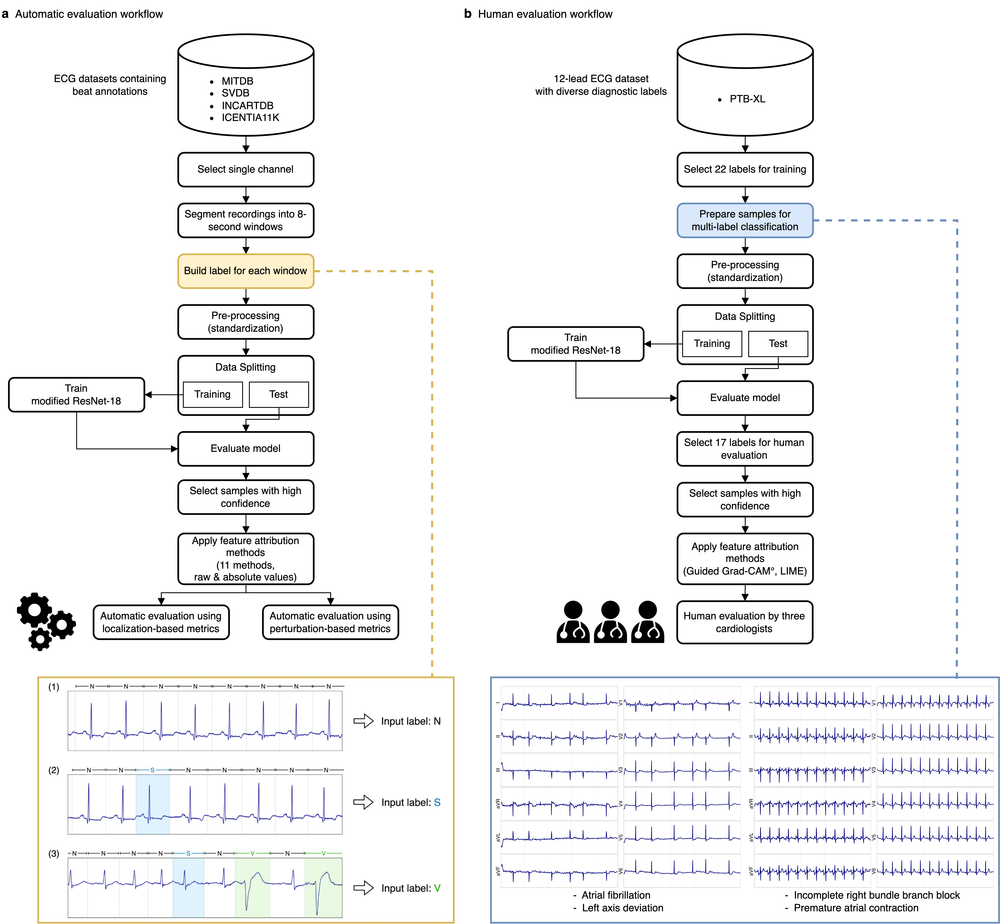

# Visual interpretation of deep learning model in ECG classification: A comprehensive evaluation of feature attribution methods

This repository contains the code for the experiments conduted in our research paper titled [*Visual interpretation of deep learning model in ECG classification: A comprehensive evaluation of feature attribution methods*](https://www.sciencedirect.com/science/article/pii/S0010482524011739).
It provides the code for evaluating feature attribution methods in heart anomaly detection tasks using ECG datasets.

<p align="center">
    
</p>

- A preliminary study related to this research is available on arXiv, titled [*Evaluating Feature Attribution Methods for Electrocardiogram*](https://arxiv.org/abs/2211.12702).

## Abstract
Feature attribution methods can visually highlight specific input regions containing influential aspects affecting a deep learning model’s prediction. Recently, the use of feature attribution methods in electrocardiogram (ECG) classification has been sharply increasing, as they assist clinicians in understanding the model’s decision-making process and assessing the model’s reliability. However, a careful study to identify suitable methods for ECG datasets has been lacking, leading researchers to select methods without a thorough understanding of their appropriateness. In this work, we conduct a large-scale assessment by considering eleven popular feature attribution methods across five large ECG datasets using a model based on the ResNet-18 architecture. Our experiments include both automatic evaluations and human evaluations. Annotated datasets were utilized for automatic evaluations and three cardiac experts were involved for human evaluations. We found that Guided Grad-CAM, particularly when its absolute values are utilized, achieves the best performance. When Guided GradCAM was utilized as the feature attribution method, cardiac experts confirmed that it can identify diagnostically relevant electrophysiological characteristics, although its effectiveness varied across the 17 different diagnoses that we have investigated.

## Citation
If you find our repository or paper useful, please consider citing our work:
```
@article{suh2024visual,
    author = {Jangwon Suh and Jimyeong Kim and Soonil Kwon and Euna Jung and Hyo-Jeong Ahn and Kyung-Yeon Lee and Eue-Keun Choi and Wonjong Rhee}
    title = {Visual interpretation of deep learning model in ECG classification: A comprehensive evaluation of feature attribution methods},
    journal = {Computers in Biology and Medicine},
    volume = {182},
    pages = {109088},
    year = {2024},
    issn = {0010-4825},
    doi = {https://doi.org/10.1016/j.compbiomed.2024.109088},
    url = {https://www.sciencedirect.com/science/article/pii/S0010482524011739},
}
```

## Requirements
This experiment was implemented using the following libraries:

- Python 3.10
- PyTorch 2.0.0
- Please refer to `requirements.txt` for other libraries.
```
    pip install -r requirements.txt
```

## Getting started

### Workflow diagram
<p align="center">
    
</p>

### Building datasets
Please refer to [this](dataset/README.md).
- Available datasets: `mitdb`, `svdb`, `incartdb`, `icentia11k`, `ptbxl`

### Training a model
```
    python train.py
        --dataset       icentia11k
        --dataset_path  ./dataset/data/icentia11k.pkl
        --result_dir    ./result_train
```
- Result: A trained model is saved in the directory specified in `--result_dir` argument.


### Computing attribution values
```
    python compute_attribution.py
        --dataset       icentia11k
        --dataset_path  ./dataset/data/icentia11k.pkl
        --model_path    ./result_train/model_last.pt
        --attr_method   gradcam
        --result_dir    ./result_attr
```
- Avaliable feature attribution methods:, `saliency`, `input_gradient`, `guided_backprop`, `integrated_gradients`, `deep_lift`, `deep_shap`, `lrp`, `lime`, `kernel_shap`, `gradcam`, `guided_gradcam`
- Result: Attribution values of test samples are saved in the directory specified in `--result_dir` argument.
    - `eval_attr_data.pkl`: Contains test samples used for evaluating feature attribution methods.
    - `attr_list.pkl`: Stores attribution values of samples found in eval_attr_data.pkl.


### Evaluating feature attribution methods
```
    python evaluate_attribution.py
        --attr_dir      ./result_attr
        --model_path    ./result_train/model_last.pt
        --eval_metric   attribution_localization
        --result_dir    ./result_eval
```
- Available evaluation metrics: `attribution_localization`, `auc`, `pointing_game`, `relevance_mass_accuracy`, `relevance_rank_accuracy`, `top_k_intersection`, `region_perturbation`, `faithfulness_correlation`
- Result: Evaluation results of feature attributions using test samples are saved in the directory specified in `--result_dir` argument.


## Conducting experiments using provided scripts
The scripts for our experiments are located in the `script` directory.
Please execute the scripts in the following order:
- `scripts/train/train_*.sh`
- `scripts/compute_attribution/compute_attribution_*.sh`
- `scripts/evaluate_attribution/evaluate_attribution_*.sh`

The scripts should be executed in the root of this repository.
```
    sh scripts/train/train_icentia11k.sh
    sh scripts/compute_attribution/compute_attribution_icentia11k.sh
    sh scripts/evaluate_attribution/evaluate_attribution_icentia11k_localization.sh
    sh scripts/evaluate_attribution/evaluate_attribution_icentia11k_perturbation.sh
```

Please note that the values of the results may vary slightly if the experiments are run on different machines or different versions of libraries.
